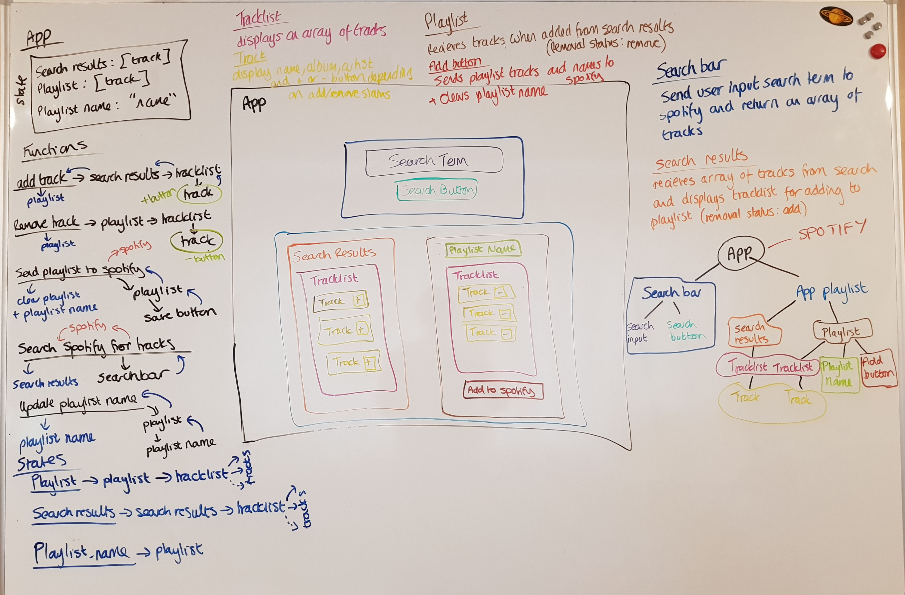

# Jamming

## Introduction

This project was a CodeCademy learning exercise to begin working with React and third party APIs. The desktop app allows users to connect to their Spotify account and add playlists. As it is connecting to their user account, it requires authentication.

## Technologies

- React
- Javascript ES6
- Spotify API
- The HTML and CSS was mostly provided by Codecademy
- Deployed with Surge

## Launch

Click on [website link](http://smelly-patch.surge.sh/ "Jamming").

## My thoughts on the project

I found this project to be a great opportunity to practice a lot of what I had learnt when undertaking the Codecademy lessons on React. It also helped me to start ‘thinking in React’. I followed the step-by-step instructions. Although this does not make the project my own, it did help me gain a deeper understanding of components and how to pass properties and functions and when to use states and event handlers.

I found it useful to work on an app where the css and styling had already been done for me. This allowed me to focus on the functionality and solidify my React knowledge, as I was able to test the functionality after each step in the process.

There seemed to be a missing instruction that meant the App would not function. The instructions did not tell you to add an onClick attribute to the search bar button. However, this was a simple fix.

Once I had completed the project, I decided to test my understanding and retrospectively wireframe the project. This helped me to clarify the functionality and how functions and properties were passed between components.

## WhiteBoarding

## API Key

Any API keys in this code have been disabled since making this code public. To use this code, you will need to obtain an API key from Spotify and insert it in the relevant place.

## My Own Improvements

Once I finished the project, I was not 100% happy with the functionality. I decided to fix the following problems

### 1. The app would error if a user clicked to save a playlist when there were no tracks in the playlist.

- I added an if function to the apps save playlist method. This would check if the playlist was empty. If so, it would display an alert to the screen and exit the function.

### 2. The previous playlist name would be left in the playlist input after adding a new playlist. It was also possible to save multiple playlists with the default name “My playlist” or no name at all

- First I split the Playlist into more components. The Tracklist was already its own component, so I added two more components – one for InputText for the playlist name and one for the SaveButton.
- I moved the function to handle the name change into the InputText component and gave the return an id of “input-text”. I also changed the defaultValue to be a placeholder.
- I moved the function to handle the save to SaveButton and included  
document.getElementById("input-text").value = "";

- in the handle save function so that the input would return back to empty and the placeholder would again display. This would also set the playlist name state of the app to empty. I set this initial value of the playlist name to also be empty to avoid the first playlist being saved as “My playlist”.

### 3. The search feature was clunky. It would not work with the enter button and the previous search term would not clear after a search had been executed

- I added an onkeypress attribute to the input
   
onKeyPress={this.keySearch}

- To deal with the key press, I added a method called keySearch that would call on search if the key was ‘Enter’
   
keySearch(e) {if (e.key === "Enter") {this.search();}}

- I gave the input an id of “search-bar” and added the following code to the search method
   
document.getElementById("search-bar").value = "";

  to clear the search bar after a search had been executed.

### 4. The page would refresh the first time a search executed. After the previous fix, this would also clear the search term without returning any results.

- I added a componentDidMount() method, that would call on Spotify.getAccessToken() when the entire app loaded for the first time.
